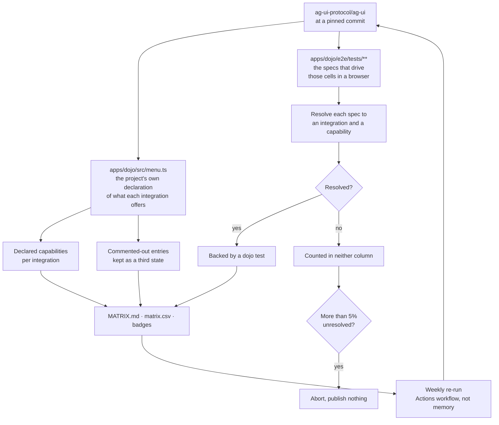

<p align="center">
  <a href="https://awesome.re"></a>
  
  
  
  
  
  
  
</p>

# Awesome AG-UI

**Agent frameworks, SDKs, middleware, and apps for AG-UI, the Agent-User Interaction Protocol, and
for every framework integration: which of the protocol's capabilities it actually implements.**

[AG-UI](https://ag-ui.com/) is an open, event-based protocol for the wire between an agent and the
screen. The agent emits about twenty standard event types, the front end renders them, and the two
sides stop being written against each other. MCP gives an agent tools, A2A lets agents talk to each
other, AG-UI puts an agent in front of a person.

Thirty framework integrations ship in the protocol repo. They are not equivalent. One declares
sixteen capabilities, another declares two, and a third declares nine while shipping one test. That
gap is not on any comparison page, so this list works it out from the protocol's own source and puts
it next to the entry.

---

## Contents

- [⭐ Featured MCP server](#-featured-mcp-server)
- [🚀 Put an agent in your front end in 30 seconds](#-put-an-agent-in-your-front-end-in-30-seconds)
- [AG-UI framework support matrix: what each integration actually implements](#ag-ui-framework-support-matrix-what-each-integration-actually-implements)
- [AG-UI capabilities, from most supported to least](#ag-ui-capabilities-from-most-supported-to-least)
- [AG-UI in DeepSeek Harness: the bridge repos](#ag-ui-in-deepseek-harness-the-bridge-repos)
- [The catalog](#the-catalog)
  - [Connect your agent framework to a front end](#connect-your-agent-framework-to-a-front-end)
  - [AG-UI SDKs, by language](#ag-ui-sdks-by-language)
  - [Middleware: change what a run does without touching the agent](#middleware-change-what-a-run-does-without-touching-the-agent)
  - [Give an AG-UI agent tools](#give-an-ag-ui-agent-tools)
  - [Render the agent in your front end](#render-the-agent-in-your-front-end)
  - [Bring the agent into chat platforms](#bring-the-agent-into-chat-platforms)
  - [Multi-agent and agent-to-agent](#multi-agent-and-agent-to-agent)
  - [Agent runtimes and platforms that speak AG-UI](#agent-runtimes-and-platforms-that-speak-ag-ui)
  - [Start from a template](#start-from-a-template)
  - [Test and debug an AG-UI app](#test-and-debug-an-ag-ui-app)
  - [Apps built on AG-UI](#apps-built-on-ag-ui)
  - [Learn AG-UI](#learn-ag-ui)
- [AG-UI spec, packages, and where to publish](#ag-ui-spec-packages-and-where-to-publish)
- [Good to know](#good-to-know)

<!-- catalogcount:start -->
**Full catalog:** all 347 AG-UI projects this list can resolve and check, in [CATALOG.md](CATALOG.md)

**Machine-readable:** the same rows as data in [catalog.csv](catalog.csv) and [projects.json](projects.json), and the capability grid in [matrix.csv](matrix.csv)
<!-- catalogcount:end -->

---

## ⭐ Featured MCP server

**Search YouTube and read the transcript** with
[youtube-mcp](https://github.com/ZeroPointRepo/youtube-mcp) by
[ZeroPointRepo](https://github.com/ZeroPointRepo). Ask for a video, get the words. Search across
channels, pull a full transcript with timestamps, and hand it to the agent that is already talking
to your users. Hosted, no Google API key. 9★, MIT.

<details>
<summary>Wire it up</summary>

The MCP middleware takes a plain header, so a hosted server with an API key needs no other plumbing:

```ts
import { MCPMiddleware } from "@ag-ui/mcp-middleware";

agent.use(
  new MCPMiddleware([
    {
      type: "http",
      url: "https://transcriptapi.com/mcp",
      serverId: "transcriptapi",
      headers: { Authorization: `Bearer ${process.env.TRANSCRIPTAPI_KEY}` },
    },
  ]),
);
```

Free tier at [transcriptapi.com](https://transcriptapi.com).

</details>

---

## 🚀 Put an agent in your front end in 30 seconds

**1. Scaffold the app.**

```bash
npx create-ag-ui-app my-agent-app
```

**2. Point it at your agent.** Pick the integration for the framework you already use from
[the catalog below](#connect-your-agent-framework-to-a-front-end), install its package, and give it
your endpoint:

```bash
npm install @ag-ui/langgraph
```

**3. Check the capability you need is actually there.** Streaming chat works everywhere. Shared
state, human in the loop, and predictive state updates do not. The
[matrix below](#ag-ui-framework-support-matrix-what-each-integration-actually-implements) says which
integration has which, before you build on it.

> Wiring a framework nobody has wired yet? Start from
> [server-starter](https://github.com/ag-ui-protocol/ag-ui/tree/main/integrations/server-starter),
> which is the smallest honest implementation of the protocol, then read
> [server-starter-all-features](https://github.com/ag-ui-protocol/ag-ui/tree/main/integrations/server-starter-all-features)
> for the rest.

---

## AG-UI framework support matrix: what each integration actually implements

<!-- matrix:start -->
The protocol repo carries a live demo app, the Dojo, whose config file is the project's own
declaration of which capabilities each integration offers, and an end to end suite that drives those
same cells in a browser. **30 integrations declare 258 capability slots between them, and 203
of those slots have a dojo test behind them.** Both numbers are read out of the repo at commit
`90c0528`, not off a comparison page.

`Backed by a dojo test` means the suite navigates to that integration's page for that capability. It
is evidence the cell runs, not a promise the feature is production ready.

| Integration | Capabilities declared | Backed by a dojo test |
|---|---:|---:|
| AWS Strands (Python) | 16 | 16 |
| AWS Strands (TypeScript) | 16 | 16 |
| CrewAI Flows | 16 | 16 |
| CrewAI Conversational Flows | 14 | 14 |
| LangGraph (FastAPI) | 14 | 14 |
| LangGraph (Python) | 14 | 14 |
| LangGraph (Typescript) | 14 | 14 |
| Mastra | 13 | 13 |
| AG-UI .NET SDK | 12 | 12 |
| Mastra Agent (Local) | 12 | 12 |
| Agno | 10 | 5 |
| Google ADK | 10 | 10 |
| Microsoft Agent Framework (.NET) | 9 | 1 |
| Microsoft Agent Framework (Python) | 9 | 1 |
| AG2 | 8 | 1 |
| Pydantic AI | 8 | 8 |
| Server Starter (All Features) | 8 | 8 |
| LlamaIndex | 7 | 7 |
| Spring AI | 6 | 1 |
| Claude Agent SDK (Python) | 5 | 5 |
| Claude Agent SDK (Typescript) | 5 | 5 |
| Open Agent Spec (LangGraph) | 5 | 1 |
| Open Agent Spec (Wayflow) | 5 | 1 |
| Claude Managed Agents (.NET) | 4 | 0 |
| Claude Managed Agents (Python) | 4 | 0 |
| Claude Managed Agents (Typescript) | 4 | 0 |
| Langroid | 4 | 4 |
| IBM watsonx orchestrate | 2 | 0 |
| Middleware Starter | 2 | 2 |
| Server Starter | 2 | 2 |

**19 of the 30 have every capability they declare under test.** The widest gaps are Microsoft Agent Framework (.NET) (1 of 9), Microsoft Agent Framework (Python) (1 of 9), AG2 (1 of 8), Spring AI (1 of 6), Agno (5 of 10). 4 integrations declare capabilities with no test behind any of them: Claude Managed Agents (.NET), Claude Managed Agents (Python), Claude Managed Agents (Typescript), IBM watsonx orchestrate.

3 more adapters sit in the repo with their dojo entry commented out, so they are shipped code
without a live cell: langchain, builtin, vercel-ai-sdk. 2 capabilities are defined in the protocol's own type and
declared by nobody yet: `a2a_chat`, `vnext_chat`.

Of 200 spec files read, 3 could not be tied to an integration and capability. They are counted
in neither column.
<!-- matrix:end -->

---

## AG-UI capabilities, from most supported to least

<!-- capabilities:start -->
23 named capabilities exist. This is how many of the 30 integrations declare each one, so
you can tell a safe assumption from a lucky one.

| Capability | Integrations |
|---|---:|
| `agentic_chat` <sub>Agentic Chat</sub> | 30 |
| `human_in_the_loop` <sub>Human in the loop</sub> | 26 |
| `backend_tool_rendering` <sub>Backend Tool Rendering</sub> | 25 |
| `tool_based_generative_ui` <sub>Tool Based Generative UI</sub> | 25 |
| `v1_agentic_chat` | 24 |
| `shared_state` <sub>Shared State between agent and UI</sub> | 22 |
| `agentic_generative_ui` <sub>Agentic Generative UI</sub> | 17 |
| `agentic_chat_multimodal` <sub>Agentic Chat Multimodal</sub> | 13 |
| `predictive_state_updates` <sub>Predictive State Updates</sub> | 13 |
| `a2ui_dynamic_schema` <sub>A2UI Dynamic Schema</sub> | 11 |
| `a2ui_fixed_schema` <sub>A2UI Fixed Schema</sub> | 11 |
| `a2ui_recovery` <sub>A2UI Error Recovery</sub> | 9 |
| `agentic_chat_reasoning` <sub>Agentic Chat Reasoning</sub> | 9 |
| `a2ui_advanced` <sub>A2UI Advanced</sub> | 6 |
| `interrupt` <sub>Interrupt (Suspend/Resume)</sub> | 6 |
| `subgraphs` <sub>Subgraphs</sub> | 4 |
| `multi_agent` <sub>Multi-Agent</sub> | 2 |
| `observational_memory` <sub>Observational Memory</sub> | 2 |
| `background_agents` <sub>Background Agents</sub> | 1 |
| `crew_chat` <sub>Crew Chat</sub> | 1 |
| `error_flow` <sub>Error Flow</sub> | 1 |
| `a2a_chat` <sub>A2A Chat</sub> | 0 |
| `vnext_chat` <sub>VNext Chat</sub> | 0 |

<!-- capabilities:end -->

Full grid, one cell per integration per capability, in [MATRIX.md](MATRIX.md), and as data in
[matrix.csv](matrix.csv).

---

## AG-UI in DeepSeek Harness: the bridge repos

DeepSeek Harness is the plugin-shaped agent harness that went from launch to six figures of stars in
a fortnight. Somebody has already wired it to AG-UI, twice, in the last four days, and neither repo
is listed anywhere else.

- **Put a DSH session behind a web front end** with [dsh-ag-ui](https://github.com/CaiZongyuan/dsh-ag-ui) by [CaiZongyuan](https://github.com/CaiZongyuan). AG-UI protocol gateway plugin for DeepSeek Harness, built on `@ag-ui/core` and `@ag-ui/encoder`. 3★, MIT.
- **Follow the DSH plus AG-UI tutorial end to end** with [DSH-AGUI-demo](https://github.com/CaiZongyuan/DSH-AGUI-demo) by [CaiZongyuan](https://github.com/CaiZongyuan). Streaming chat, page-aware context, typed tools, and human-confirmed workflows, wired to CopilotKit. 3★.

The plugins those sessions run are catalogued in
[awesome-dsh-plugins](https://github.com/ZeroPointRepo/awesome-dsh-plugins).

---

## The catalog

### Connect your agent framework to a front end

- **Bring a Google ADK agent into a front end** with [adk-python](https://github.com/google/adk-python) by [google](https://github.com/google). Ten capabilities including three of the four A2UI cells. Python middleware. 21,302★, Apache-2.0.
- **Connect an AG2 conversation to the browser** with [ag2](https://github.com/ag2ai/ag2) by [ag2ai](https://github.com/ag2ai). Eight declared capabilities. 4,891★, Apache-2.0.
- **Attach a UI to Microsoft Agent Framework** with [agent-framework](https://github.com/microsoft/agent-framework) by [microsoft](https://github.com/microsoft). Nine declared capabilities in .NET and Python. 13,137★, MIT.
- **Run an Open Agent Spec agent over AG-UI** with [agent-spec](https://github.com/oracle/agent-spec) by [oracle](https://github.com/oracle). Oracle's portable agent format, wired through the protocol in two flavours, one backed by LangGraph and one by Wayflow. 405★, Apache-2.0.
- **Run an AG-UI agent on Cloudflare** with [agents](https://github.com/cloudflare/agents) by [cloudflare](https://github.com/cloudflare). Community integration for Cloudflare's Agents SDK. 5,490★, MIT.
- **Put an Agno agent behind a copilot** with [agno](https://github.com/agno-agi/agno) by [agno-agi](https://github.com/agno-agi). Ten declared capabilities, reasoning and multimodal chat among them. 41,937★, Apache-2.0.
- **Bridge the Vercel AI SDK** with [ai](https://github.com/vercel/ai) by [vercel](https://github.com/vercel). Adapter present, dojo entry commented out pending AI SDK v5 support. 26,434★.
- **Front-end the Claude Agent SDK** with [claude-agent-sdk-python](https://github.com/anthropics/claude-agent-sdk-python) by [anthropics](https://github.com/anthropics). Five capabilities in Python and TypeScript: chat, backend tool rendering, shared state, human in the loop, tool-based generative UI. 7,983★, MIT.
- **Drive a CrewAI Flow from the browser** with [crewAI](https://github.com/crewAIInc/crewAI) by [crewAIInc](https://github.com/crewAIInc). The widest declared surface of any integration: sixteen capabilities, including the crew chat and error-path cells nothing else has. 57,658★, MIT.
- **Connect Firebase Genkit to AG-UI** with [genkit](https://github.com/genkit-ai/genkit) by [genkit-ai](https://github.com/genkit-ai). Community integration living in the protocol repo. 6,381★, Apache-2.0.
- **Run AWS Strands agents with a UI attached** with [harness-sdk](https://github.com/strands-agents/harness-sdk) by [strands-agents](https://github.com/strands-agents). Sixteen capabilities in both Python and TypeScript, including multi-agent and interrupt. 7,025★, Apache-2.0.
- **Reach IBM watsonx Orchestrate from a front end** with [ibm-watsonx-orchestrate-adk](https://github.com/IBM/ibm-watsonx-orchestrate-adk) by [IBM](https://github.com/IBM). Two declared capabilities, chat only so far. 176★, MIT.
- **Serve a LangChain agent over AG-UI** with [langchain](https://github.com/langchain-ai/langchain) by [langchain-ai](https://github.com/langchain-ai). The adapter is in the repo and has e2e specs, but its dojo entry is commented out, so it is not a live cell today. 145,090★, MIT.
- **Stream a LangGraph run into a React app** with [langgraph](https://github.com/langchain-ai/langgraph) by [langchain-ai](https://github.com/langchain-ai). Fourteen of the twenty-three dojo capabilities, including subgraphs and predictive state updates. Python, TypeScript, and FastAPI adapters all ship in the protocol repo. 40,521★, MIT.
- **Stream Langroid agents to a UI** with [langroid](https://github.com/langroid/langroid) by [langroid](https://github.com/langroid). Four capabilities: chat, backend tool rendering, agentic generative UI, shared state. 4,101★, MIT.
- **Give a LlamaIndex agent a front end** with [llama_index](https://github.com/run-llama/llama_index) by [run-llama](https://github.com/run-llama). Seven capabilities, backend tool rendering included. 51,885★, MIT.
- **Wire a Mastra agent to a chat UI** with [mastra](https://github.com/mastra-ai/mastra) by [mastra-ai](https://github.com/mastra-ai). Thirteen capabilities including suspend and resume, and the observational-memory cell. TypeScript, with a local-agent variant. 27,507★.
- **Serve a Pydantic AI agent over AG-UI** with [pydantic-ai](https://github.com/pydantic/pydantic-ai) by [pydantic](https://github.com/pydantic). Eight capabilities. Predictive state updates sit commented out in the dojo config, so treat that one as off. 19,524★, MIT.
- **Put a Spring AI agent behind a copilot** with [spring-ai](https://github.com/spring-projects/spring-ai) by [spring-projects](https://github.com/spring-projects). Community integration. Six declared capabilities, Java. 9,361★, Apache-2.0.
- **Serve a Wayflow agent to a front end** with [wayflow](https://github.com/oracle/wayflow) by [oracle](https://github.com/oracle). Oracle's agent runtime, reached through the Open Agent Spec adapter. 189★, Apache-2.0.

### AG-UI SDKs, by language

- **Emit and consume AG-UI events in TypeScript** with [@ag-ui/core (TypeScript)](https://github.com/ag-ui-protocol/ag-ui/tree/main/sdks/typescript). Core types, client, encoder, and proto packages. Everything on npm under the @ag-ui scope.

  <details>
  <summary>Wire it up</summary>

  SDK

  </details>

- **Speak AG-UI from .NET** with [AG-UI .NET SDK](https://github.com/ag-ui-protocol/ag-ui/tree/main/sdks/dotnet). Twelve declared dojo capabilities, the highest of any SDK-only integration.

  <details>
  <summary>Wire it up</summary>

  SDK

  </details>

- **Consume AG-UI from Kotlin Multiplatform** with [ag-ui-4k](https://github.com/Contextable/ag-ui-4k) by [Contextable](https://github.com/Contextable). Client library targeting Android, iOS, desktop, and web from one Kotlin codebase. 21★, MIT.
- **Emit AG-UI events from Python** with [ag-ui-protocol (Python)](https://github.com/ag-ui-protocol/ag-ui/tree/main/sdks/python). The reference Python SDK: event types, encoder, and the HTTP shape every Python integration builds on.

  <details>
  <summary>Wire it up</summary>

  SDK

  </details>

- **Build AG-UI agents in Go** with [agent-sdk-go](https://github.com/hastekit/agent-sdk-go) by [hastekit](https://github.com/hastekit). Go agent SDK with Temporal and Restate support for durable runs. 12★, Apache-2.0.
- **Render AG-UI in Flutter** with [agentivity_ag_ui](https://github.com/agentivity-labs/agentivity_ag_ui) by [agentivity-labs](https://github.com/agentivity-labs). Dart package for agent-driven UI. 3★, MIT.
- **Define agents in a typed Kotlin DSL** with [Agents.KT](https://github.com/Deep-CodeAI/Agents.KT) by [Deep-CodeAI](https://github.com/Deep-CodeAI). Kotlin framework for agent systems that emits AG-UI. 13★, MIT.
- **Speak AG-UI from seven more languages** with [Community SDKs](https://github.com/ag-ui-protocol/ag-ui/tree/main/sdks/community). C++, Dart, Go, Java, Kotlin, Ruby, and Rust, all in the protocol repo under sdks/community.

  <details>
  <summary>Wire it up</summary>

  SDK

  </details>


### Middleware: change what a run does without touching the agent

- **Let an AG-UI agent delegate to A2A agents** with [@ag-ui/a2a-middleware](https://github.com/ag-ui-protocol/ag-ui/tree/main/middlewares/a2a-middleware). Turns remote Agent2Agent peers into callable participants in a single run.

  <details>
  <summary>Wire it up</summary>

  MIDDLEWARE

  </details>

- **Stream structured UI instead of text** with [@ag-ui/a2ui-middleware](https://github.com/ag-ui-protocol/ag-ui/tree/main/middlewares/a2ui-middleware). Carries A2UI, the open JSON UI payload, over an AG-UI run.

  <details>
  <summary>Wire it up</summary>

  MIDDLEWARE

  </details>

- **Slow a firehose of events down to something a browser can paint** with [@ag-ui/event-throttle-middleware](https://github.com/ag-ui-protocol/ag-ui/tree/main/middlewares/event-throttle-middleware). Throttles high-frequency event streams before they reach the client.

  <details>
  <summary>Wire it up</summary>

  MIDDLEWARE

  </details>

- **Render an MCP App inside an AG-UI run** with [@ag-ui/mcp-apps-middleware](https://github.com/ag-ui-protocol/ag-ui/tree/main/middlewares/mcp-apps-middleware). Bridges the MCP Apps UI extension into the AG-UI event stream.

  <details>
  <summary>Wire it up</summary>

  MIDDLEWARE

  </details>

- **Give any AG-UI agent a set of MCP tools** with [@ag-ui/mcp-middleware](https://github.com/ag-ui-protocol/ag-ui/tree/main/middlewares/mcp-middleware). Lists each MCP server's tools, injects them into the run as mcp__{server}__{tool}, executes the calls server side, and loops until none are left. Takes a plain Authorization header, so a static-key server needs no extra plumbing.

  <details>
  <summary>Wire it up</summary>

  MIDDLEWARE

  </details>

- **Write your own middleware** with [@ag-ui/middleware-starter](https://github.com/ag-ui-protocol/ag-ui/tree/main/middlewares/middleware-starter). The scaffold the four middlewares above are shaped like.

  <details>
  <summary>Wire it up</summary>

  MIDDLEWARE

  </details>

- **Reach a coding agent that speaks ACP** with [acp-to-agui](https://github.com/namanrajpal/acp-to-agui) by [namanrajpal](https://github.com/namanrajpal). Protocol bridge sitting between ACP coding agents and an AG-UI front end. 22★, MIT.
- **Put a Google ADK agent behind AG-UI in Python** with [adk-agui-middleware](https://github.com/trendmicro/adk-agui-middleware) by [trendmicro](https://github.com/trendmicro). Third-party middleware with its own session, state, and streaming handling. 40★, MIT.
- **Serve AG-UI from a Cloudflare Worker** with [ag-ui-cloudflare](https://github.com/Klammertime/ag-ui-cloudflare) by [Klammertime](https://github.com/Klammertime). Native protocol adapter for Workers AI. 8★, MIT.
- **Front-end a Dify app** with [ag-ui-dify-adapter](https://github.com/JasonYoo2020/ag-ui-dify-adapter) by [JasonYoo2020](https://github.com/JasonYoo2020). Translates Dify API responses into AG-UI events. 2★, MIT.
- **Chain AG-UI runs together** with [agui-chain](https://github.com/alibaba/agui-chain) by [alibaba](https://github.com/alibaba). Alibaba's TypeScript composition layer over @ag-ui/core. 12★, MIT.
- **Put an OpenClaw agent behind a web UI** with [clawg-ui](https://github.com/contextablemark/clawg-ui) by [contextablemark](https://github.com/contextablemark). AG-UI channel for OpenClaw, built on @ag-ui/core and @ag-ui/encoder. 62★, MIT.
- **Drive Claude Code from a browser copilot** with [copilotkit-claudecode-bridge](https://github.com/DaveDushi/copilotkit-claudecode-bridge) by [DaveDushi](https://github.com/DaveDushi). Bridge from an AG-UI front end to the Claude Code CLI. 7★.
- **Serve an AG-UI agent from Django** with [django-ag-ui](https://github.com/Artui/django-ag-ui) by [Artui](https://github.com/Artui). Django to Pydantic AI to AG-UI, an endpoint and the wiring around it. 2★, MIT.
- **Make a Java LangGraph speak AG-UI** with [langgraph4j-copilotkit](https://github.com/langgraph4j/langgraph4j-copilotkit) by [langgraph4j](https://github.com/langgraph4j). AG-UI compliance layer for langgraph4j. 31★, MIT.
- **Extract structured blocks out of a token stream** with [streamblocks](https://github.com/hotherio/streamblocks) by [hotherio](https://github.com/hotherio). Real-time block parsing with an AG-UI output mode. 2★.

### Give an AG-UI agent tools

- **Turn a sentence into a rendered UI over MCP** with [GenUI_MCP](https://github.com/adner/GenUI_MCP) by [adner](https://github.com/adner). MCP Apps server that generates interface descriptions an AG-UI front end renders. 10★, MIT.
- **Wire MCP servers into a copilot** with [mcp-client](https://github.com/CopilotKit/mcp-client) by [CopilotKit](https://github.com/CopilotKit). Smaller companion client for the same job. 12★.
- **Talk to any MCP server from an agent chat** with [open-mcp-client](https://github.com/CopilotKit/open-mcp-client) by [CopilotKit](https://github.com/CopilotKit). Reference client showing an MCP-backed agent end to end. 1,647★.
- **Search your docs and code from the chat** with [pathfinder](https://github.com/CopilotKit/pathfinder) by [CopilotKit](https://github.com/CopilotKit). Self-hosted MCP server for documentation and code search. 34★.
- **Look up a US property, its Zestimate, and its price history** with [zillow-mcp](https://github.com/ZeroPointRepo/zillow-mcp) by [ZeroPointRepo](https://github.com/ZeroPointRepo). Hosted MCP server for Zillow data. Takes a plain bearer key, so it drops straight into the MCP middleware config above. 1★, MIT.

### Render the agent in your front end

- **Add a chat element with one tag** with [ag-ui-web-component](https://github.com/Artui/ag-ui-web-component) by [Artui](https://github.com/Artui). Framework-free <ag-ui-chat> custom element speaking the protocol directly. 2★, MIT.
- **Render A2UI natively on iOS, Android, and HarmonyOS** with [AGenUI](https://github.com/AGenUI/AGenUI) by [AGenUI](https://github.com/AGenUI). High-performance streaming renderer for the structured-UI payload AG-UI carries. 1,120★, Apache-2.0.
- **Build agentic Angular apps** with [angular-agent-framework](https://github.com/cacheplane/angular-agent-framework) by [cacheplane](https://github.com/cacheplane). Angular SDK over @ag-ui/client with generative UI support. 70★, MIT.
- **Drop a copilot into a React, Angular, or mobile app** with [CopilotKit](https://github.com/CopilotKit/CopilotKit) by [CopilotKit](https://github.com/CopilotKit). The reference front-end stack for AG-UI, from the team that wrote the protocol. Chat, generative UI, shared state, and human in the loop out of the box. 37,068★, MIT.
- **Use Vue 3 instead of React** with [CopilotKitVue](https://github.com/Aenas11/CopilotKitVue) by [Aenas11](https://github.com/Aenas11). Native Vue bindings for the CopilotKit stack. 4★.
- **Add a copilot to a Plotly Dash app** with [dash-copilotkit](https://github.com/dash-copilotkit/dash-copilotkit) by [dash-copilotkit](https://github.com/dash-copilotkit). Dash component library wrapping the CopilotKit runtime. 2★.
- **Study a finished generative-UI front end** with [financial-agent-ui](https://github.com/virattt/financial-agent-ui) by [virattt](https://github.com/virattt). Financial agent with a full generative interface. 794★.
- **Build the front end in Vue** with [galvanized-pukeko](https://github.com/pukeko-robotics/galvanized-pukeko) by [pukeko-robotics](https://github.com/pukeko-robotics). Generative UI for agents, Vue flavour. 5★, MIT.
- **Keep a streaming agent interface accessible** with [generative-a11y](https://github.com/bhaveshchow20/generative-a11y) by [bhaveshchow20](https://github.com/bhaveshchow20). Accessibility runtime for streaming AI and agent UIs. 1★, MIT.
- **Render generative UI from any agent** with [OpenGenerativeUI](https://github.com/CopilotKit/OpenGenerativeUI) by [CopilotKit](https://github.com/CopilotKit). Framework-level generative UI, not tied to one chat component. 1,521★, MIT.
- **Stream shadcn components instead of plain text** with [shadify](https://github.com/CopilotKit/shadify) by [CopilotKit](https://github.com/CopilotKit). Server streams generated shadcn/ui components into the chat. 263★, MIT.
- **Reach for a Vue component library** with [vue-copilotkit](https://github.com/fe-51shebao/vue-copilotkit) by [fe-51shebao](https://github.com/fe-51shebao). Vue port of the CopilotKit React UI kit. 87★, MIT.

### Bring the agent into chat platforms

- **Put your agent in Slack, Teams, or Discord** with [channels-sdk](https://github.com/CopilotKit/channels-sdk) by [CopilotKit](https://github.com/CopilotKit). One SDK that carries an AG-UI agent into any chat platform. 873★, MIT.
- **Reach users on WhatsApp** with [langgraph-whatsapp-bot](https://github.com/GreatHayat/langgraph-whatsapp-bot) by [GreatHayat](https://github.com/GreatHayat). LangGraph workflow behind a WhatsApp channel. 23★.
- **Run a self-hosted on-call agent** with [OpenTag](https://github.com/CopilotKit/OpenTag) by [CopilotKit](https://github.com/CopilotKit). The Channels SDK starter, wired end to end. 1,123★, MIT.

### Multi-agent and agent-to-agent

- **See A2A and AG-UI in one app** with [a2a-demo](https://github.com/ag-ui-protocol/a2a-demo) by [ag-ui-protocol](https://github.com/ag-ui-protocol). The protocol org's own demo of an AG-UI front end delegating to A2A peers. 26★, MIT.
- **Watch specialised agents split a task** with [a2a-travel-demo-app](https://github.com/TheGreatBonnie/a2a-travel-demo-app) by [TheGreatBonnie](https://github.com/TheGreatBonnie). Travel planner built on the A2A middleware. 10★.
- **Read a compact A2A wiring example** with [ag-ui-a2a-demo](https://github.com/markmdev/ag-ui-a2a-demo) by [markmdev](https://github.com/markmdev). Front end plus middleware, small enough to read in one sitting. 20★.
- **Study a reference multi-agent architecture** with [copilot-agent-network](https://github.com/iknowcodesoup/copilot-agent-network) by [iknowcodesoup](https://github.com/iknowcodesoup). Reference layout for larger agent systems. 0★.
- **Manage several agents in one chat** with [open-multi-agent-canvas](https://github.com/CopilotKit/open-multi-agent-canvas) by [CopilotKit](https://github.com/CopilotKit). Open-source multi-agent chat interface. 526★.

### Agent runtimes and platforms that speak AG-UI

- **Run managed agents next to notebooks** with [agent-runtimes](https://github.com/datalayer/agent-runtimes) by [datalayer](https://github.com/datalayer). Agent runtimes built on @ag-ui/client. 21★.
- **Build on a production multi-agent platform** with [AgenticX](https://github.com/DemonDamon/AgenticX) by [DemonDamon](https://github.com/DemonDamon). Unified platform with AG-UI output. 218★, Apache-2.0.
- **Orchestrate a pool of configured agents** with [agentpool](https://github.com/phil65/agentpool) by [phil65](https://github.com/phil65). Unified hub with an AG-UI agent mode. 183★, MIT.
- **Ship an agent on Bedrock AgentCore** with [bedrock-agentcore-sdk-python](https://github.com/aws/bedrock-agentcore-sdk-python) by [aws](https://github.com/aws). AWS SDK with an ag-ui extra that turns any agent into an AG-UI endpoint. 755★, Apache-2.0.
- **Run a pluggable agent microservice** with [core](https://github.com/cheshire-cat-ai/core) by [cheshire-cat-ai](https://github.com/cheshire-cat-ai). Long-running agent framework with AG-UI as a first-class output. 3,085★, GPL-3.0.
- **Assemble a crew from a form** with [crewform](https://github.com/CrewForm/crewform) by [CrewForm](https://github.com/CrewForm). Orchestration product built on the protocol. 44★, AGPL-3.0.
- **Turn plain English into an n8n workflow** with [N8N_Builder](https://github.com/vbwyrde/N8N_Builder) by [vbwyrde](https://github.com/vbwyrde). Automation builder using the Python SDK. 7★.
- **Self-host a LangGraph platform** with [open-langgraph-platform](https://github.com/HyunjunJeon/open-langgraph-platform) by [HyunjunJeon](https://github.com/HyunjunJeon). Agent Protocol server with an AG-UI surface. 20★, MIT.
- **Query OpenSearch through an agent** with [opensearch-agent-server](https://github.com/opensearch-project/opensearch-agent-server) by [opensearch-project](https://github.com/opensearch-project). Agent server from the OpenSearch project. 18★, Apache-2.0.
- **Self-host an agentic workflow platform** with [PawFlow-Agents](https://github.com/allcolor/PawFlow-Agents) by [allcolor](https://github.com/allcolor). Workflow platform with an AG-UI front end. 23★, MIT.
- **Start from a pluggable AG-UI server** with [ravnar](https://github.com/nebari-dev/ravnar) by [nebari-dev](https://github.com/nebari-dev). A server whose whole job is speaking the protocol properly. 1★, Apache-2.0.
- **Register and discover agents** with [registry](https://github.com/zonlabs/registry) by [zonlabs](https://github.com/zonlabs). Backend service for agent registration. 1★.

### Start from a template

- **Bootstrap a full agent studio** with [agent-studio-starter](https://github.com/nsphung/agent-studio-starter) by [nsphung](https://github.com/nsphung). Starter wiring an agent, a UI, and the protocol together. 28★, Apache-2.0.
- **Start a SaaS with agents already wired** with [AIaaS-Boilerplate-Framework](https://github.com/Vesias/AIaaS-Boilerplate-Framework) by [Vesias](https://github.com/Vesias). Next.js boilerplate with AG-UI in the stack. 2★.
- **Start a generative-UI project in an afternoon** with [generative-ui-london-hackathon-starter](https://github.com/jerelvelarde/generative-ui-london-hackathon-starter) by [jerelvelarde](https://github.com/jerelvelarde). Hackathon starter on the A2A middleware. 8★, MIT.
- **Reuse a LangGraph toolkit** with [langgraph-kit](https://github.com/allada-homelab/langgraph-kit) by [allada-homelab](https://github.com/allada-homelab). Memory, tools, and orchestration with an agui extra. 2★, AGPL-3.0.
- **Write an AG-UI server from scratch** with [server-starter](https://github.com/ag-ui-protocol/ag-ui/tree/main/integrations/server-starter). The minimum honest implementation: chat, in Python and TypeScript.

  <details>
  <summary>Wire it up</summary>

  STARTER

  </details>

- **Implement every capability once** with [server-starter-all-features](https://github.com/ag-ui-protocol/ag-ui/tree/main/integrations/server-starter-all-features). Eight capabilities in one reference server, and the fastest way to see what each event does.

  <details>
  <summary>Wire it up</summary>

  STARTER

  </details>


### Test and debug an AG-UI app

- **Mock everything the app talks to** with [aimock](https://github.com/CopilotKit/aimock) by [CopilotKit](https://github.com/CopilotKit). LLM APIs, MCP, A2A, AG-UI, and vector stores, all faked so tests stay fast and deterministic. 902★, MIT.
- **Watch the event stream go by** with [copilotkit-debugger](https://github.com/mnutt/copilotkit-debugger) by [mnutt](https://github.com/mnutt). Debugger for the runtime's traffic. 6★.
- **Practise on a broken app on purpose** with [find-the-bug](https://github.com/CopilotKit/find-the-bug) by [CopilotKit](https://github.com/CopilotKit). Deliberately faulty app used for debugging drills. 3★.

### Apps built on AG-UI

- **Backtest and paper-trade equities** with [alpatrade](https://github.com/predictivelabsai/alpatrade) by [predictivelabsai](https://github.com/predictivelabsai). Trading workbench with an AG-UI surface. 2★, Apache-2.0.
- **Reason over a biomedical knowledge graph** with [ATHENA](https://github.com/mims-harvard/ATHENA) by [mims-harvard](https://github.com/mims-harvard). Harvard research agent for treatment reasoning. 63★, MIT.
- **Run an AI desktop companion** with [Cyrene-Agent](https://github.com/Playa-0v0/Cyrene-Agent) by [Playa-0v0](https://github.com/Playa-0v0). Desktop agent built on @ag-ui/client. 426★, MIT.
- **Search open research data** with [data-commons-search](https://github.com/EOSC-Data-Commons/data-commons-search) by [EOSC-Data-Commons](https://github.com/EOSC-Data-Commons). Search server across open access data sources. 14★, MIT.
- **Analyse data in an agent workbench** with [datafoundry](https://github.com/datagallery-ai/datafoundry) by [datagallery-ai](https://github.com/datagallery-ai). Open-source AI workbench unifying data analysis behind a copilot. 740★, Apache-2.0.
- **Watch competitive intelligence assemble itself** with [Dominad](https://github.com/samy-clivolt/Dominad) by [samy-clivolt](https://github.com/samy-clivolt). Ads intelligence platform on @ag-ui/client. 3★, MIT.
- **Draw diagrams from the chat** with [excalidraw-studio](https://github.com/CopilotKit/excalidraw-studio) by [CopilotKit](https://github.com/CopilotKit). Generate, edit, and export Excalidraw diagrams with live preview. 52★, MIT.
- **Ask questions about satellite imagery** with [geovision](https://github.com/dsouzavijeth/geovision) by [dsouzavijeth](https://github.com/dsouzavijeth). Conversational geospatial analysis. 12★.
- **Give an agent Agent Skills** with [haiku.skills](https://github.com/ggozad/haiku.skills) by [ggozad](https://github.com/ggozad). Skill-powered agents implementing the Agent Skills spec, with AG-UI as the surface. 9★, MIT.
- **Review a contract in the browser** with [Legal-Document-Reviewer](https://github.com/ARYPROGRAMMER/Legal-Document-Reviewer) by [ARYPROGRAMMER](https://github.com/ARYPROGRAMMER). Next.js document reviewer. 8★.
- **Use a modular Gen-AI suite** with [MyAIBOX](https://github.com/aleck31/MyAIBOX) by [aleck31](https://github.com/aleck31). Agent with tool use and MCP, AG-UI on the front. 2★, MIT.
- **Build on a Gemini-backed canvas** with [open-gemini-canvas](https://github.com/CopilotKit/open-gemini-canvas) by [CopilotKit](https://github.com/CopilotKit). Canvas app wired to Gemini. 153★.
- **Run a research canvas** with [open-research-ANA](https://github.com/CopilotKit/open-research-ANA) by [CopilotKit](https://github.com/CopilotKit). Agent-native research application. 400★.

### Learn AG-UI

- **Follow an ADK video-style demo** with [adk-ag-ui-demo](https://github.com/AIAnytime/adk-ag-ui-demo) by [AIAnytime](https://github.com/AIAnytime). Compact ADK plus AG-UI example. 6★, MIT.
- **See grounding wired into an agent** with [ag-ui-adk-grounding-app](https://github.com/Greyisheep/ag-ui-adk-grounding-app) by [Greyisheep](https://github.com/Greyisheep). Full-stack ADK agent with Maps and Search grounding. 5★, MIT.
- **Poke at an ADK playground** with [ag-ui-adk-react-chat](https://github.com/rrazvd/ag-ui-adk-react-chat) by [rrazvd](https://github.com/rrazvd). Small React chat for exploring the ADK integration. 12★.
- **Implement AG-UI with CrewAI** with [ag-ui-crewai-research](https://github.com/Folken2/ag-ui-crewai-research) by [Folken2](https://github.com/Folken2). Worked example of the CrewAI path. 45★, MIT.
- **Read a first-contact demo** with [AG-UI-Protocol-Demo](https://github.com/BradenStitt/AG-UI-Protocol-Demo) by [BradenStitt](https://github.com/BradenStitt). Hands-on walkthrough bridging Pydantic AI and a front end. 2★, MIT.
- **Study a Korean-language agent course** with [Agent_Studio](https://github.com/Pseudo-Lab/Agent_Studio) by [Pseudo-Lab](https://github.com/Pseudo-Lab). Community study repo built around the protocol. 21★.
- **Compare a React client with a vanilla one** with [agui_demo](https://github.com/breeznik/agui_demo) by [breeznik](https://github.com/breeznik). LangGraph agent driving both, side by side. 18★.
- **Try the Microsoft Agent Framework path** with [AgUI_MicrosoftAgentFramework_Sample](https://github.com/adner/AgUI_MicrosoftAgentFramework_Sample) by [adner](https://github.com/adner). Sample wiring MAF to an AG-UI client. 5★, MIT.
- **Work through an enterprise workshop** with [frontier-agents-workshop](https://github.com/denniszielke/frontier-agents-workshop) by [denniszielke](https://github.com/denniszielke). Microsoft Agent Framework workshop pinned to a specific protocol version. 34★, MIT.
- **Wire a framework nobody has wired yet** with [Quickstart: build a new integration](https://go.copilotkit.ai/agui-contribute). Official guide for adding a framework integration.

  <details>
  <summary>Wire it up</summary>

  DOC

  </details>

- **Get a running app in one sitting** with [Quickstart: build an AG-UI application](https://docs.ag-ui.com/quickstart/applications). Official quickstart for the application side.

  <details>
  <summary>Wire it up</summary>

  DOC

  </details>

- **Click through every capability, on every integration** with [The AG-UI Dojo](https://dojo.ag-ui.com/). The protocol's own live matrix. Each cell is one capability running against one framework, and its source is in the repo.

  <details>
  <summary>Wire it up</summary>

  DOC

  </details>

- **Look up what each of the event types means** with [The event reference](https://docs.ag-ui.com/concepts/events). The list of events every integration is measured against.

  <details>
  <summary>Wire it up</summary>

   DOC

  </details>


---

## AG-UI spec, packages, and where to publish

- **Read the protocol itself** at [ag-ui](https://github.com/ag-ui-protocol/ag-ui) by [ag-ui-protocol](https://github.com/ag-ui-protocol). Event types, SDKs, integrations, middleware, and the dojo, all in one repo. 15,567★, MIT.
- **Read the docs** at [ag-ui.com](https://ag-ui.com/). Concepts, event reference, quickstarts, and the integration guides.
- **Install the TypeScript packages** from [npm](https://www.npmjs.com/org/ag-ui), published under the `@ag-ui` scope.
- **Install the Python package** from [PyPI](https://pypi.org/project/ag-ui-protocol/), `ag-ui-protocol`.
- **Ask the maintainers** in the [AG-UI Discord](https://discord.gg/Jd3FzfdJa8).
- **Add a framework** by following the [integration quickstart](https://go.copilotkit.ai/agui-contribute), then open a PR on the protocol repo.

---

## Good to know

<details>
<summary><strong>How the capability matrix is built</strong></summary>



That pipeline is a workflow in this repo
([`verify-matrix.yml`](.github/workflows/verify-matrix.yml)), not a diagram drawn once. It runs every
Monday, rebuilds both columns from the protocol repo at whatever commit is current that morning, and
writes the badges at the top of this page from that run's actual result. An integration that adds a
capability gets a wider row the following Monday. One that adds a test gets a second tick.

Three limits worth stating. A declared capability is what the project says its integration offers,
which is a strong claim from the people who wrote both halves, but it is still their claim. A
resolved spec proves the cell is driven in CI, not that the feature is complete. And a spec the
parser cannot tie to an integration and a capability is reported as unresolved and counted in
neither column, rather than guessed at; if more than one spec in twenty ends up there, the run
aborts and publishes nothing.

</details>

<details>
<summary><strong>🛡️ Security notice</strong></summary>

This is a **curated list, not a security audit**. An AG-UI agent runs with whatever your backend can
reach, and the middleware layer means a single run can call MCP tools, delegate to A2A peers, and
render UI the agent chose. A project's presence here means it resolves through the GitHub API and
carries a real AG-UI or CopilotKit dependency in its own manifest, not that its code has been
reviewed for safety.

Read a project's source before you run it or hand it credentials, the same as any dependency. Found
one that seems malicious rather than merely broken? Open an issue and say so plainly, or use
GitHub's private vulnerability reporting on that project's own repo.

</details>

<details>
<summary><strong>🤝 Contributing</strong></summary>

PRs are very welcome, see [CONTRIBUTING.md](CONTRIBUTING.md) for the format and the acceptance
rules.

</details>

<details>
<summary><strong>Related lists</strong></summary>

- [awesome-dsh-plugins](https://github.com/ZeroPointRepo/awesome-dsh-plugins): DeepSeek Harness plugins, every install command machine-checked weekly, and the ecosystem the two AG-UI bridge repos above plug into.
- [awesome-agent-plugins](https://github.com/ZeroPointRepo/awesome-agent-plugins): plugins built on the open Agent Plugins standard, every entry checked for a real `$schema`.
- [awesome-cursor-plugins](https://github.com/ZeroPointRepo/awesome-cursor-plugins): the Cursor marketplace with a portability and sign-in column on every entry.
- [awesome-fx-skills](https://github.com/ZeroPointRepo/awesome-fx-skills): skills, MCP servers, and subagents for Vercel's fx coding agent.
- [awesome-hermes-skills](https://github.com/ZeroPointRepo/awesome-hermes-skills): skills, plugins, memory providers, and surfaces for the Hermes agent.
- [awesome-grok-bot](https://github.com/ZeroPointRepo/awesome-grok-bot): skills, plugins, and MCP servers for Grok Bot.

</details>

---

<p align="center">
Maintained by <a href="https://github.com/ZeroPointRepo">ZeroPointRepo</a> · list content licensed
<a href="https://creativecommons.org/licenses/by/4.0/">CC BY 4.0</a> · Built with
<a href="https://crhq.ai">crhq.ai</a>
<br />
<sub>Unofficial, community-maintained. Not affiliated with or endorsed by CopilotKit or the AG-UI project.</sub>
</p>
